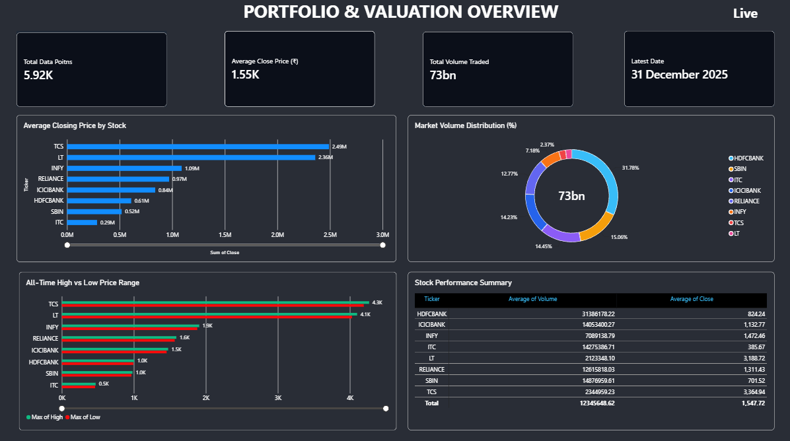
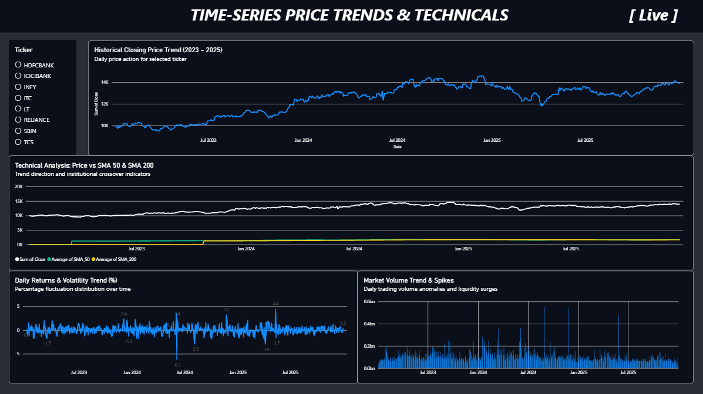
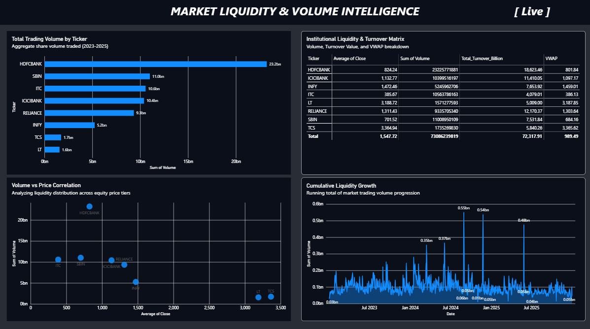

# 📈 FinTech & Stock Analytics Dashboard — Power BI

A Bloomberg-inspired **financial analytics dashboard** built using **Power BI, DAX, Power Query, and Python**, analyzing historical stock market data from **2023–2025**.

## 📊 Dashboard Pages

### 1. Portfolio & Valuation Overview

* KPI cards
* All-Time High / Low
* Trading volume distribution
* Stock performance comparison



### 2. Time-Series Price Trends & Technical Analysis

* Interactive stock selector
* Historical closing prices
* SMA 50 & SMA 200
* Daily returns
* Volume spike analysis



### 3. Liquidity & Volume Intelligence

* Total turnover
* VWAP analysis
* Cumulative volume
* Price-volume relationship



### 4. Volatility & Risk Analytics

* Volatility analysis
* Drawdown evaluation
* Risk-adjusted performance
* Stability comparison


## 🛠️ Tech Stack

* **Power BI Desktop**
* **DAX**
* **Power Query**
* **Python**
* **Pandas & NumPy**

## 📌 Key Metrics

* **Total Turnover** = Price × Volume
* **VWAP** = Σ(Price × Volume) / Σ(Volume)
* **SMA 50 & SMA 200**
* **Daily Returns**
* **Volatility**
* **Drawdown**


## 🚀 Getting Started

```bash
git clone https://github.com/Chirag-g11/Bloomberg-fintech-powerbi-dashboard.git
```

Open the `.pbix` file in **Power BI Desktop** and refresh the dataset.


## 👨‍💻 Author

**Chirag Goyal**
B.Tech Information Technology

[GitHub](https://github.com/Chirag-g11) · [LinkedIn](https://www.linkedin.com/in/chirag-goyal-a7715a289/)
